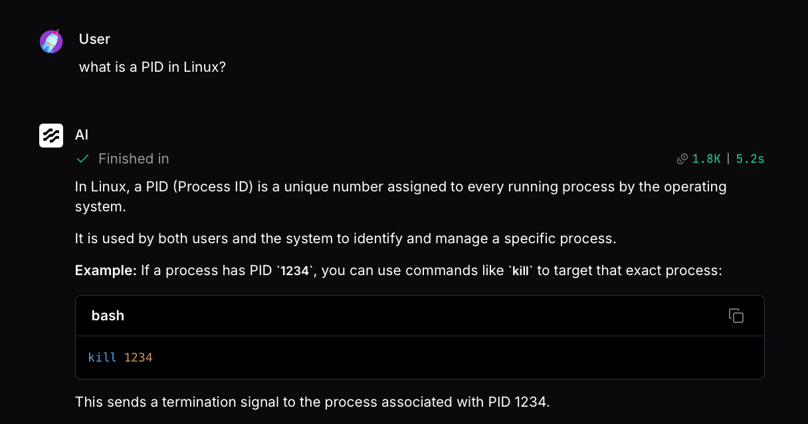
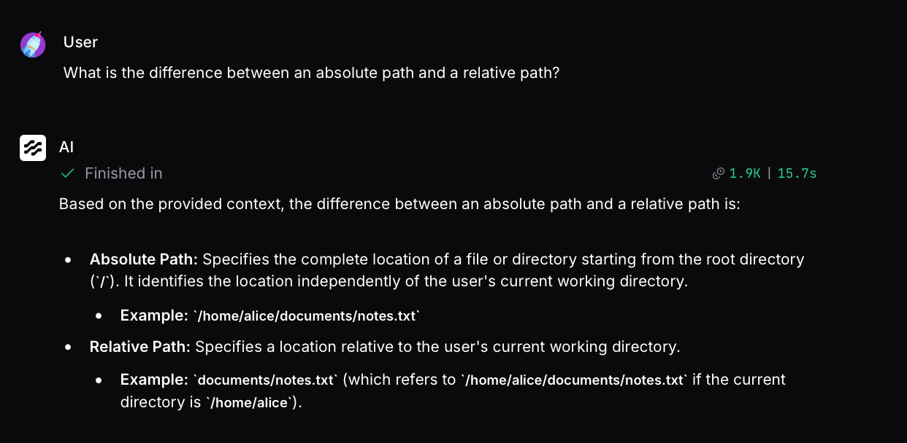
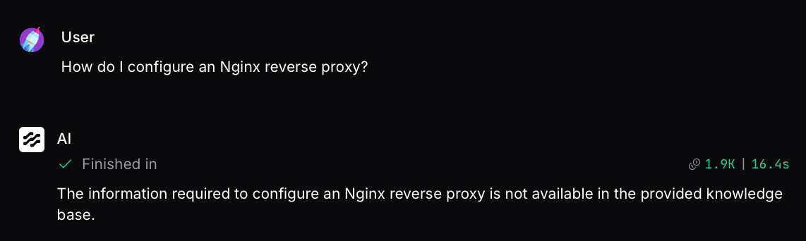

# Linux Support Assistant

A RAG-based AI assistant built with Langflow that answers Linux technical questions using a curated knowledge base.

## What I Built

The assistant uses three Linux documents covering:

- Linux commands
- Linux filesystem and paths
- Linux processes

It retrieves relevant information from the knowledge base and uses that context to generate grounded answers. If the required information is not available, the assistant is instructed not to guess.

## Architecture

```text
                         ┌──→ Knowledge Retrieval
                         │          ↓
                         │        Parser
                         │          ↓
User Question ───────────┼──────→ Context
                         │
                         └──────→ Question
                                    ↓
                              Prompt
                                    ↓
                              Gemini Agent
                                    ↓
                              Chat Output
```

The workflow takes the user's question, retrieves relevant information from the Linux knowledge base, and combines the retrieved context with the original question in the prompt before sending it to the Gemini agent.

The knowledge base uses document chunking, Gemini embeddings, and a local Chroma vector store for semantic retrieval.

## Technologies

- Langflow
- Google Gemini
- Gemini Embeddings (`models/gemini-embedding-001`)
- Chroma Vector Store
- Retrieval-Augmented Generation (RAG)

## Knowledge Base

```text
knowledge/
├── linux_commands.txt
├── linux_filesystem.txt
└── linux_processes.txt
```

## Example Questions & Results

### 1. What is a PID in Linux?

The assistant retrieved the relevant process information and correctly explained that a PID (Process ID) uniquely identifies a running process.



### 2. What is the difference between an absolute path and a relative path?

The assistant retrieved the filesystem information and correctly explained both path types with examples.



### 3. How do I configure an Nginx reverse proxy?

The information was not present in the knowledge base, so the assistant responded that it was unavailable instead of generating an unsupported answer.



## How to Run

Create and activate a virtual environment, install Langflow, and start it:

```bash
uv venv .venv
source .venv/bin/activate
uv pip install langflow
uv run langflow run
```

Then open Langflow and import:

```text
langflow/workflow.json
```

A Google Gemini API key is required for the LLM and embedding model.

## Project Structure

```text
linux-rag-assistant/
├── README.md
├── knowledge/
│   ├── linux_commands.txt
│   ├── linux_filesystem.txt
│   └── linux_processes.txt
└── langflow/
    └── workflow.json
```

## What I Learned

This project helped me understand how a RAG workflow works in practice, including document chunking, embeddings, vector search, semantic retrieval, prompt grounding, and connecting these components together in Langflow.

## Problem Encountered

I initially tried OpenAI embeddings, but the API returned an `insufficient_quota` error because no credits were available.

I then tried `gemini-embedding-2`, which caused an ingestion error in my Langflow setup. Switching to `models/gemini-embedding-001` successfully indexed the knowledge base and allowed the RAG workflow to work correctly.

## Future Improvements

- Add conversation memory
- Expand the Linux knowledge base
- Add a web interface
- Add additional troubleshooting tools
